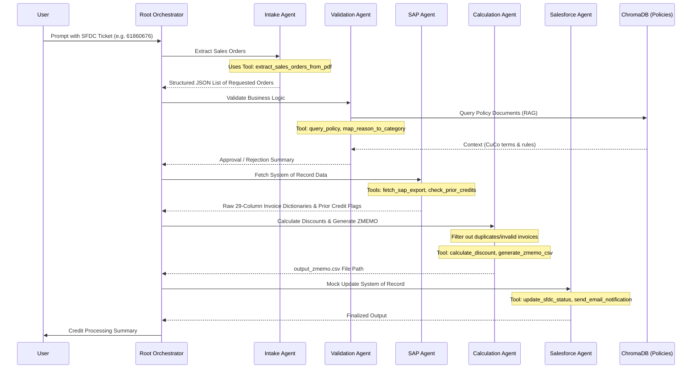

# AI-Automated Batch Credit Processing

This prototype demonstrates a multi-agent system built using the [Google Agent Development Kit (ADK) Python SDK](https://github.com/google/agent-development-kit). The system automates the manual "Batch Credit Request" process by digesting Salesforce (SFDC) tickets, validating credit eligibility against policies stored in a ChromaDB RAG system, fetching data from SAP exports, calculating the appropriate discounts, and generating a ZMEMO row upload file.

## Architecture

The system is constructed as a `SequentialAgent` pipeline orchestrated by a root `intake_agent`:
1.  **Intake Agent (`agent.py`)**: Primary entry point. Extracts the list of Sales Orders and issue details from the SFDC ticket PDF.
2.  **Validation & Policy Agent (`validation_agent`)**: Enforces business logic and contract compliance using a locally initialized ChromaDB representing the 2025 Contract Policies.
3.  **SAP Integration Agent (`sap_agent`)**: Fetches raw invoice details from mock SAP exports and checks the prior credit history logs to prevent duplicates.
4.  **Calculation Agent (`calculation_agent`)**: Calculates correct credit amounts using percentage logic and outputs the required ZMEMO CSV format.
5.  **Salesforce & Communication Agent (`salesforce_agent`)**: Simulates updating the system of record and notifying stakeholders of the final outcome.

## Setup Instructions

### 1. Prerequisites
- Python 3.10+
- Google Cloud Project with Vertex AI enabled
- [adk CLI installed locally](https://pypi.org/project/google-adk/) (installed automatically via the instructions below)

### 2. Virtual Environment Setup
Clone the repository and install the required dependencies inside a virtual environment:
```bash
python3 -m venv .venv
source .venv/bin/activate
pip install -r requirements.txt
```

### 3. Google API Key Configuration
Create a `.env` file at the root of the project with your Google Cloud Vertex AI configuration:
```env
# Google Cloud Project Configuration
GOOGLE_CLOUD_PROJECT=your-project-id
GOOGLE_CLOUD_LOCATION=us-central1

# Ensures Gemini uses the Vertex AI endpoints instead of Gemini Developer API endpoints
GOOGLE_GENAI_USE_VERTEXAI=True
```

### 4. Initialize Policy Database (ChromaDB)
The system uses a Local Vector Database for validating rules against the provided Master Policies. Run the setup script to chunk and embed the PDF policies:
*(Requires docling and langchain_text_splitters which are included in the requirements)*
```bash
python shared/chroma_setup.py
```

## Running the Agent

### Interactive CLI
The ADK allows you to step through the agent interactions using a command-line interface:
```bash
adk run .
```

When the `[user]:` prompt appears, you can run the primary "Happy Path" test case to analyze the sample ticket:
```
Analyze SFDC Ticket #61860676
```

### Expected Output
The system will run sequentially through the sub-agents and print its findings directly in the terminal.
1. `intake_agent` will parse the PDF and extract 17 Sales Orders.
2. `sap_agent` will find the invoice details but discover one invalid item and others missing from the simulated database.
3. `calculation_agent` will drop the non-eligible/duplicate invoices, calculate the 52%, 54%, and 55% discount logic on the eligible ones, and generate a final `output_zmemo.csv` file at the root.
4. `salesforce_agent` will mock an email sending the results and conclude the run.

### Web UI
You can also interact with the Agent system via a generated Web Chat interface. Run the following command:
```bash
adk web
```
This will launch a local server (typically at `http://localhost:8080`) where you can paste the prompt and view execution traces.

## Datasets and Mock Data

This system simulates a complex multi-tool enterprise environment by relying on the following mock files contained in the `Sample Data` folder:
- **`File1-SFDC-Credit-Request-Ticket.pdf`**: Represents the initial trigger for the workflow. It is an unstructured ticket export from Salesforce containing a description of the customer's request, reason for credit (CuCo contract confusion), requested discount percentages, and a table of affected Sales Orders (SOs). 
- **`Policy_Documents/` (PDFs)**: Contains the text for regional Master Agreements (e.g., CuCo-2025 Benelux). These are embedded into ChromaDB and queried by the Validation Agent to confirm the request aligns with contractual obligations before approving credits.
- **`File5-SAP-Transactional-Export.csv`**: Simulates the system of record (SAP backend). It holds the raw, 29-column transaction details of historical invoices. The SAP Agent searches this file to fetch the original pricing, material numbers, and other mandatory fields required for the final ZMEMO export.
- **`File6-Prior-Credit-History-Log.csv`**: Simulates a historical ledger of previously issued credit memos. Searched by the SAP Agent to prevent processing duplicate credits for the same order.

## Complete Agent Workflow

The orchestrated execution of the system is managed by the root `SequentialAgent`. Here is the exact lifecycle of an SFDC ticket being processed:



## ZMEMO Output Format

The final outcome of a successful run is the `output_zmemo.csv` file generated at the project root. This CSV is perfectly formatted as a 29-column SAP-compatible batch upload payload.

The Calculation Agent is explicitly instructed to synthesize required "green fields" that are missing from the raw SAP data. For example:
- **Sales Document Type VBAK-AUART** is hardcoded as `Z09` (Standard Credit Memo).
- **Serial #** is sequentially counted for each valid exported row.
- **Reference Billing Document** is mapped directly from the verified invoice number.
- **Order reason VBAK-AUGRU** is generated as `C35` (Goodwill Exception).
- **ZPR0 KOMV-KBETR(02)** is dynamically calculated based on the SAP original net amount multiplied by the requested percentage discount from the ticket.

## Application Demo

### Knowledge source and Input
The Command Center displays PDF reading capabilities (e.g. Master Policies) alongside the raw, unprocessed Mock SAP CSV Database. 


### Agent Live Execution Stream
Once "Analyze" is clicked, you can visually observe the real-time thought processing as the Sequential Agent breaks down tasks, executes database lookups, and dynamically queries the local vector database.


### Generated ZMEMO Batch Interface
The pipeline concludes by outputting a properly formatted batch CSV holding the newly calculated values mapped cleanly to synthetic SAP columns (highlighted in green).

